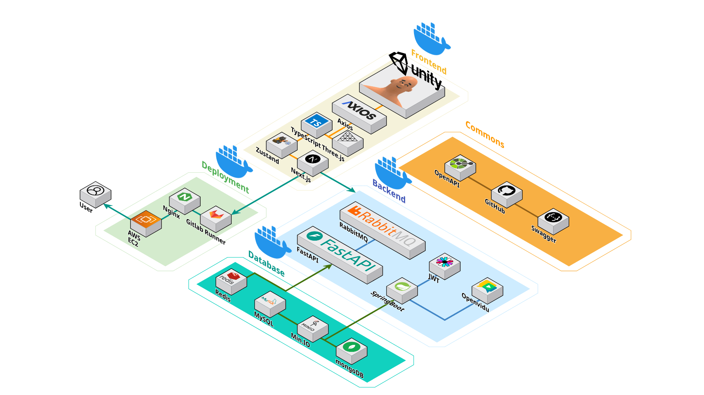

# 🎸 딩가딩 (Ding-Ga-Ding) 프로젝트

## 📌 목차

1. [홍보 영상](#-홍보-영상)
2. [프로젝트 소개](#-프로젝트-소개)
3. [핵심 목표](#-핵심-목표)
4. [주요 기능](#-주요-기능)
5. [기술 아키텍처](#-기술-아키텍처)
6. [기술 스택](#-기술-스택)
7. [산출물](#-산출물)
8. [팀 소개](#-팀-소개)

## 🎬 홍보 영상

  <video src="https://github.com/user-attachments/assets/415d64c5-54c7-4d49-924a-e779e8c9049b" controls playsinline width="900"></video>

## 🚀 프로젝트 소개

**SSAFY 12기 프로젝트 (S12P21E107)**

> AI 음성 인식 기반의 연주 실력 측정 및 밴드 구인구직 플랫폼

딩가딩은 음성인식 AI를 통해 사용자의 연주 실력을 분석하고 티어를 측정하여, 실력에 맞는 밴드를 찾을 수 있도록 도와주는 서비스입니다. 더 나아가 라이브하우스 기능을 통해 실시간으로 다른 연주자들과 소통하고 함께 연주할 수 있는 환경을 제공합니다.

## 🎯 핵심 목표

1. **🔍 정확한 밴드 구인구직 매칭**
   - 실력 기반의 구인구직으로 적합한 밴드원 찾기
   - 라이브하우스, 채팅 등을 통한 쉬운 구인구직 프로세스

2. **🏆 실력 측정을 통한 사용자 동기 부여**
   - AI 기반 연주 평가 시스템 (비트감, 음정, 톤)
   - 티어 시스템을 통한 실력 향상 동기 부여

3. **🤝 커뮤니티 활성화**
   - 라이브하우스를 통한 실시간 연주 및 소통

## 🚀 주요 기능

### 📊 실력 측정 시스템

- **💯 랭크 게임**: 특정 곡을 연주하여 실력 측정
- **🏅 티어 시스템**: IRON, BRONZE, SILVER, GOLD, PLATINUM, DIAMOND 등급으로 구분
- **📈 점수 분석**: 비트감(Beat), 음정(Tune), 톤(Tone) 세 가지 요소 평가

### 👥 밴드 및 구인구직

- **👨‍🎤 밴드 생성 및 관리**: 본인의 밴드 생성 및 멤버 관리
- **🔎 맞춤형 구인**: 필요한 악기와 티어를 지정하여 멤버 모집

### 🏠 라이브하우스

- **🎭 실시간 연주**: 최대 인원 설정, 연주자/관객 역할 선택
- **🎬 연주자 기능**: 음성 스트리밍, 악기별 GLB 모델 및 애니메이션

## 🗺️ 기술 아키텍처

## 🛠️ 기술 스택

### 백엔드

- **☕ Java 17 / Spring Boot 3**: REST API, WebSocket, OAuth2
- **🗄️ MySQL / MongoDB**: 관계형·문서형 데이터 저장
- **⚡ Redis / RabbitMQ**: 캐시·비동기 메시징
- **📝 OpenAPI 3.0**: API 스펙 및 코드 생성

### 프론트엔드

- **⚛️ Next.js 15 / React 19**: 웹 UI
- **🎨 Three.js / React Three Fiber**: 3D 연주 환경

### AI

- **🐍 Python / FastAPI / Celery**: 음성 분석 파이프라인

### 3D 모델링

- **🎨 Unity**: 악기 GLB 모델 및 애니메이션 제작

### 인프라

- **☁️ AWS / MinIO**: 파일 스토리지
- **🔄 CI/CD**: GitLab, Jenkins

## 📦 산출물

| 항목 | 경로 |
|------|------|
| 아키텍처 다이어그램 | `exec/Architecture.png` |
| DB 덤프·ERD | `exec/DB덤프파일/` |
| 화면 시나리오 | `exec/시나리오/` |
| 외부 서비스 설정 가이드 | `exec/외부서비스.md` |
| 로컬 개발 가이드 | `exec/README.MD` |

## 👥 팀 소개

| 박태건 | 김민수 | 이종화 | 박준호 | 김나율 |
| ------ | ------ | ------ | ------ | ------ |
| FE, PM | FE, 기획 | AI, 기획 | BE, Infra | BE |
